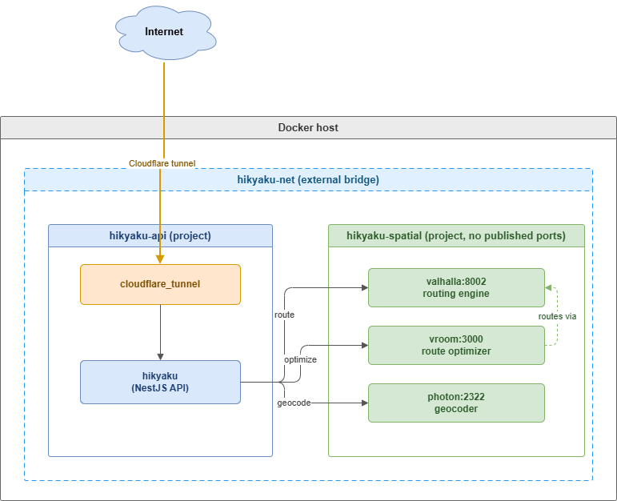

# Hikyaku infrastructure

Two decoupled Docker Compose projects that talk to each other over a private
bridge network. The API can be redeployed without touching the heavy, slow-to-
build spatial stack, and nothing spatial is exposed to the internet.

| File | Compose project | Services |
|------|-----------------|----------|
| `docker-compose.yml` | `hikyaku-api` | `hikyaku` (+ `cloudflare_tunnel` in prod) |
| `docker-compose.staging.yml` | `hikyaku-api-staging` | `hikyaku-staging` (+ `cloudflare_tunnel` in staging) |
| `spatial-docker-compose.yml` | `hikyaku-spatial` | `valhalla`, `vroom`, `photon` |

Staging runs alongside prod on the same host (distinct container name, no published
ports) and shares the one `hikyaku-spatial` stack over `hikyaku-net` — there's no
separate staging spatial stack. It tracks the `staging` branch: pushing to `staging`
builds and pushes `ghcr.io/hikyakuorg/hikyaku-api:staging` (see
`.github/workflows/docker-ghcr.yml`), which this compose file pulls.

## How they connect

Both projects attach to an **external** Docker network, `hikyaku-net`. Docker's
embedded DNS resolves services by name across projects, so `hikyaku` reaches the
spatial services as `http://valhalla:8002` etc. — no host ports, no IPs.

The spatial services publish **no** host ports, so they are reachable only by
containers on `hikyaku-net` — not from localhost, the LAN, or the internet.
See [Optional: LAN / tailnet access](#optional-lan--tailnet-access) to change that.



## One-time setup

1. **Create the shared network**:

   ```bash
   docker network create hikyaku-net
   ```

2. **Provide the files the compose stacks expect**:

   | Path | Used by | Notes |
   |------|---------|-------|
   | `.env.prod` | `hikyaku` | API secrets + the spatial URLs below |
   | `.env.staging` | `hikyaku-staging` | Same shape as `.env.prod`, pointed at staging secrets/DB |
   | `vroom-conf/config.yml` | `vroom` | point `routingServers.valhalla` at `http://valhalla:8002` |
   | `photon/photon-1.1.0.jar` + `photon/photon_data/` | `photon` | jar and prebuilt index (see Photon mount below) |
   | `valhalla_tiles/` | `valhalla` | created automatically on first boot |

3. In `db` folder, run `docker compose up -d` to create the database and seed
   data (or run `setup_db.sh` directly).

   `tzdata.timezone` is no longer seeded here: the API populates it itself, in
   a background worker thread, the first time it boots against an empty table
   (see `src/tzdata`). It's pinned to a specific timezone-boundary-builder
   release + checksum; bumping that for a geopolitical timezone change means
   updating `src/tzdata/tzdata.constants.ts` and truncating the table so the
   next boot re-imports.

### `.env.prod` — wiring the API to the spatial services

The API resolves each spatial service from an env var. Set them to the service names; they resolve over `hikyaku-net`:

```dotenv
VALHALLA_URL=http://valhalla:8002
VROOM_URL=http://vroom:3000
PHOTON_URL=http://photon:2322
```

## Running

```bash
# spatial stack
docker compose -f spatial-docker-compose.yml up -d

# api stack (prod)
docker compose up -d

# api stack (staging)
docker compose -f docker-compose.staging.yml up -d
```

> **First boot is slow.** Valhalla downloads the Australia-Oceania PBF and builds
> routing tiles before it answers — VROOM and the API will error until that
> finishes. Watch `docker compose -f spatial-docker-compose.yml logs -f valhalla`.

## Recommendations


### 1. LAN access

To reach the spatial services from other machines, publish the port **bound to a
specific interface** — the bind address decides how far it's exposed:

| `ports:` entry | Reachable from | Internet? |
|----------------|----------------|-----------|
| *(none — default)* | `hikyaku` container only | no |
| `"127.0.0.1:8002:8002"` | the host only | no |
| `"<host-LAN-IP>:8002:8002"` | your LAN | no |
| `"<tailscale-IP>:8002:8002"` | your tailnet | no |
| `"8002:8002"` (= `0.0.0.0`) | LAN **+ internet if host has a public IP** | maybe |

Caveats:

- `"8002:8002"` binds all interfaces; on a public-IP host that **is** internet
  exposure. Bind to a specific IP to make "LAN-only" intentional.
- **Docker bypasses `ufw`/`firewalld`** — a published port punches through the OS
  firewall. Control exposure with the bind address, not the firewall.
- The spatial services have **no auth**; anyone who can reach the port can use
  them. Prefer a Tailscale-IP bind for private cross-machine access.

Ports: `valhalla` 8002, `vroom` 3000, `photon` 2322.
